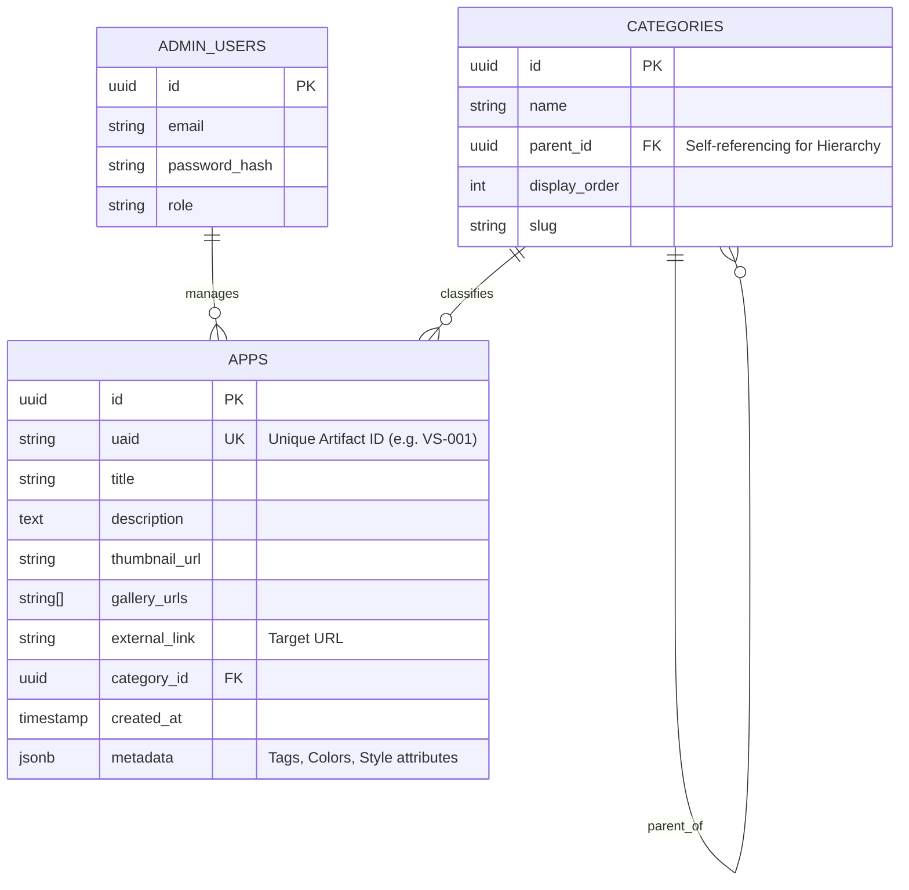

# Database Design

## ER Diagram

## Schema Details

### 1. `apps` Table
-   **Storage:** Stores metadata. Actual images are in Supabase Storage buckets (`/apps/{uaid}/*`).
-   **`uaid`:** Human-readable ID (String 6-8 chars). Critical for the "Bibimbap" strategy.
-   **`external_link`:** The destination URL opened in a new tab.

### 2. `categories` Table
-   **Adjacency List Model:** Uses `parent_id` to create infinite depth (though UI limits to 2-3 levels).
-   **`slug`:** For SEO-friendly URLs (e.g., `/game/rpg`).

### 3. Storage Buckets
-   `public-assets`: For UI elements.
-   `portfolio-images`: Read-public, Write-Admin-only.
