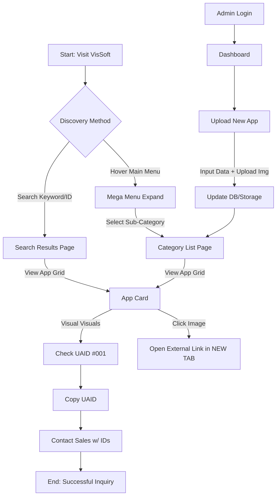

# User Flow: VisSoft Recommendation Journey

## Key Flows
1.  **The "Browsing" Loop:** Landing $\to$ Hierarchy Menu $\to$ Filtered Grid $\to$ Popup View.
2.  **The "Reference" Loop:** Spot App $\to$ Note #UAID $\to$ Contact.
